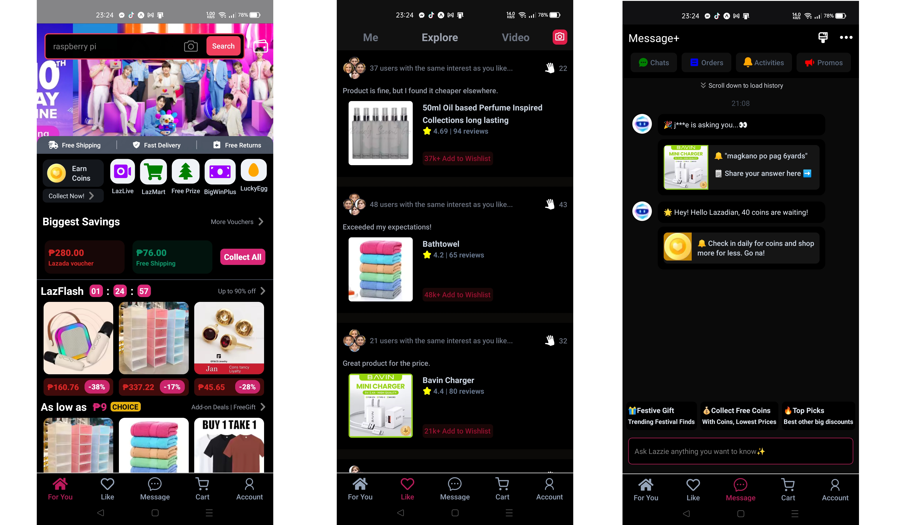
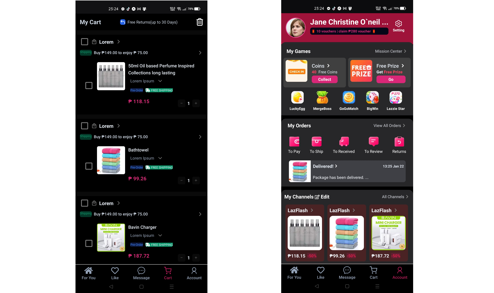

# React Native - Lazada Mobile UI Clone 👋

This is a React Native project that replicates the UI of the Lazada Mobile App. It features 5 screens, showcasing a mobile shopping app layout.

## Features:

- **Home**: Displays featured products and categories.
- **Like**: Section for favorited items.
- **Message**: Chat interface for user interactions.
- **Cart**: Shopping cart with selected items.
- **Account**: User profile and settings.

## Built with:

- **React-Native(Typescript)**: Displays featured products and categories.
- **NativeWind**: Section for favorited items.

### Installation:

1. Clone the repo:

   ```bash
   git clone https://github.com/Adrian9502/react-native-shopping-app
   ```

2. Navigate to the project directory:

   ```bash
   cd react-native-shopping-app
   ```

3. Install dependencies:

   ```bash
   npm install
   ```

4. Run the app on your device/emulator:

For Android:

```bash
npx react-native run-android
```

For iOS (macOS only):

```bash
npx react-native run-ios
```

### Screenshots



